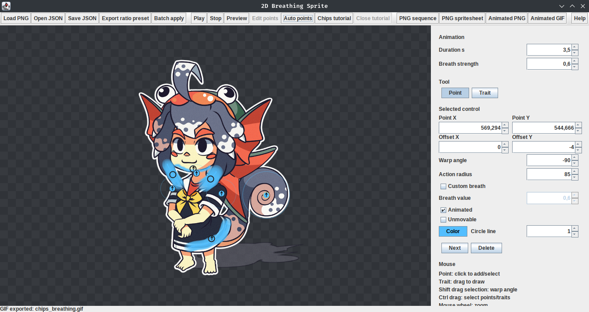
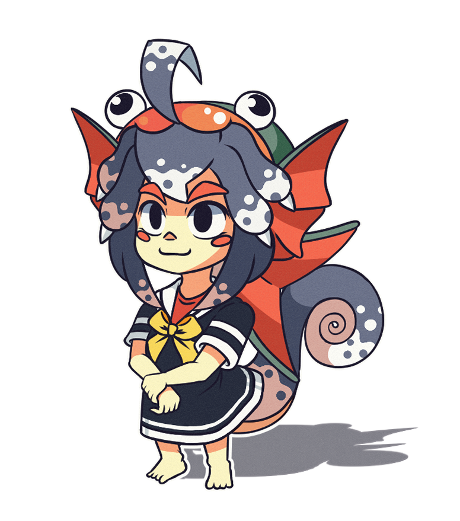
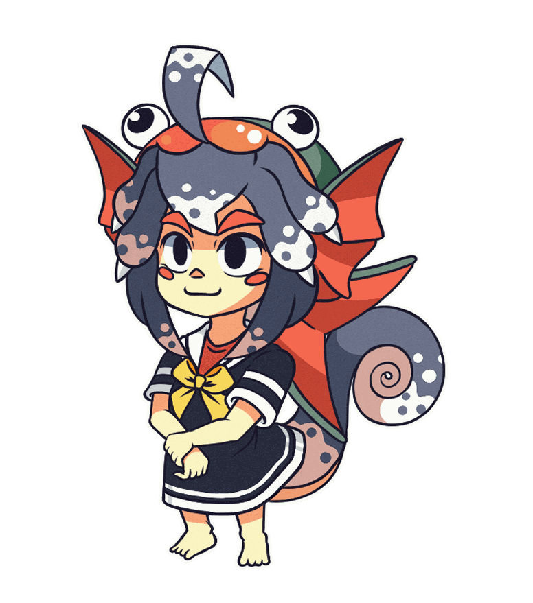

# Breath

This project is released under the Apache License 2.0, except for the `chips.png` mascot. The Chips mascot belongs to Maxime: https://linktr.ee/ChocoPain. All mascot rights remain his. Thanks to him; if you want to thank me for this software, please support him on Patreon (https://www.patreon.com/ChocoPain) or Ko-fi (https://ko-fi.com/chocopain).



| Non breathing (`chips.png`) | Breathing (`chips_breathing.gif`) | Breathing Apng (`chips_breathing.png`) |
| --- | --- |  --- |
|  |   |  |


Download standalone binaries: https://github.com/bussiere/breathapp/releases

GitHub repository: https://github.com/bussiere/breathapp

Small Java/Swing editor for adding a subtle breathing animation to a 2D PNG sprite.

***This project is a very simple 2D animation tool designed to offer a similar but much simpler workflow than software like Spine2D.

Note: Spine is a registered trademark of Esoteric Software LLC. This project is independent and is not affiliated with, sponsored by, or endorsed by Esoteric Software.***

The implementation follows the spec summarized in `spec/logiciel-respiration-2d-swing.md`: the image is warped with control-point influence fields, without a skeleton or mesh system.

## Run The App

```bash
./run-breath.sh
```

Gradle equivalent:

```bash
./gradlew run
```

## Built-In Chips Tutorial

In the app, click `Chips tutorial`.

The tutorial loads `app/src/main/resources/tutorial/chips_breath_project.json`, which contains:

- the Chips PNG embedded as `imageBase64`;
- control-point coordinates;
- optional free-line `strokes` for drawn warp or lock regions;
- `duration`;
- `breathingStrength`;
- the `unmovable` flag for locked points and strokes.

The Chips preset is intentionally constrained to the upper body. Earlier points were too low and their radii were too large, so the influence reached the pelvis and legs. The current preset uses two unmovable shoulder points, two chest points, one upper-abdomen point, and one unmovable low anchor above the pelvis.

## Key Controls

- `Point` / `Trait`: switches between point placement and free-line drawing.
- In `Point` mode, click to add/select a control point, then drag to move it.
- `Point X` / `Point Y`: exact pixel coordinates of the selected point on the source image. Editing these fields moves that point numerically.
- In `Trait` mode, drag on the sprite to draw a free warp line.
- `Breath strength`: multiplies offsets for animated points and traits.
- `Custom breath`: when enabled on a selected point or trait, that control uses its own `Breath value` instead of the global `Breath strength`.
- `Action radius`: influence radius of the selected point or trait. Reduce it if deformation spreads too far.
- `Offset X` / `Offset Y`: maximum movement of the selected point or trait.
- `Warp angle`: rotates the selected animated point or trait direction while keeping its current offset distance.
- `Animated`: enables breathing offsets for the selected point or trait.
- Animated controls show an inner arrow for the positive warp direction.
- `Unmovable`: locks pixels inside the point radius or along the trait radius so animated controls cannot move that zone.
- `Color`: changes the selected point or trait display color and saves it in the project JSON.
- `Circle line`: cosmetic outline width for selected points only; it does not change the deformation radius.
- `Preview`: renders frames in the background, then shows the animation in-app without exporting files.
- `Edit points`: returns from preview to the control editor.
- `Shift` + drag on an animated point or trait adjusts the warp angle directly on the sprite.
- `Ctrl` + drag draws a selection box for selecting multiple points and traits. `Delete` or `Backspace` removes the selection.
- Mouse wheel zooms at the cursor; right or middle drag pans.

## Export

The app exports:

- a PNG sequence (`breath_000.png`, etc.);
- a PNG spritesheet;
- a TexturePacker/Aseprite-style JSON texture atlas for that spritesheet;
- a `.atlas` texture atlas for that spritesheet;
- an animated PNG/APNG;
- an animated GIF.

Generate the demo outputs without opening the UI:

```bash
scripts/export-demo.sh
```

Generated files:

- `export/chips_points_overlay.png` if `scripts/annotate-chips-points.sh` has been run
- `export/chips_breath_spritesheet.png`
- `export/chips_breath_spritesheet.json`
- `export/chips_breath_spritesheet.atlas`
- `export/chips_breath_apng.png`
- `export/chips_breath.gif`
- `export/frames/breath_000.png` through `breath_029.png`

The app remembers the last folder used for loading, saving, or exporting, then reopens file choosers in that same directory.

APNG is the recommended animated format when the sprite relies on alpha transparency or soft edges. GIF export is useful for broad compatibility, but GIF has only limited transparency support and is best with sprites prepared on an opaque background.


## Ratio Presets And Batch Export

`Export ratio preset` writes a lightweight JSON file containing only controls, not the source image. Positions are stored as ratios of the image size:

- point `xRatio` is `point.x / imageWidth`;
- point `yRatio` is `point.y / imageHeight`;
- stroke vertices use the same `xRatio` / `yRatio` representation;
- `offsetXRatio` and `offsetYRatio` scale with width and height;
- `radiusRatio` scales with the smaller image dimension.

This lets the same breathing setup be applied to sprites with different dimensions. The preset also stores duration, global breath strength, animated/unmovable flags, colors, point circle outline width, and optional per-control `customBreathingStrength`.

Example ratio preset shape:

```json
{
  "format": "breath-control-ratio-preset",
  "version": 1,
  "duration": 3.5,
  "breathingStrength": 1.0,
  "points": [
    {
      "xRatio": 0.90000000,
      "yRatio": 0.10000000,
      "offsetXRatio": 0.01000000,
      "offsetYRatio": -0.02000000,
      "radiusRatio": 0.08000000,
      "animated": true,
      "unmovable": false,
      "color": "#53BEFF",
      "outlineWidth": 1.0,
      "customBreathingStrength": null
    }
  ],
  "strokes": [
    {
      "offsetXRatio": 0.00000000,
      "offsetYRatio": -0.02000000,
      "radiusRatio": 0.06000000,
      "animated": true,
      "unmovable": false,
      "color": "#53BEFF",
      "customBreathingStrength": 0.75,
      "points": [
        {"xRatio": 0.30000000, "yRatio": 0.40000000},
        {"xRatio": 0.60000000, "yRatio": 0.42000000}
      ]
    }
  ]
}
```

`Batch apply` reads one ratio preset, asks for one or more PNG images, then asks for an output directory and export format. Available batch formats are:

- GIF (`*_breath.gif`);
- spritesheet with TexturePacker/Aseprite JSON and `.atlas` (`*_breath_sheet.png`, `*_breath_sheet.json`, `*_breath_sheet.atlas`);
- animated PNG/APNG (`*_breath_apng.png`).

Batch export uses the preset duration and breath strength. Per-control custom breath values still override the preset/global breath strength.

## Pillow Point Overlay

```bash
scripts/annotate-chips-points.sh
```

The script uses `uv run --with pillow` and writes `export/chips_points_overlay.png`.

## JSON Project Save

`Save JSON` creates a portable project with the image embedded as base64. Example shape:

```json
{
  "image": "chips.png",
  "imageName": "chips.png",
  "imageBase64": "...",
  "duration": 3.5,
  "breathingStrength": 1.0,
  "points": [
    {
      "x": 116.0,
      "y": 126.0,
      "offsetX": 0.0,
      "offsetY": 0.0,
      "radius": 30.4,
      "animated": false,
      "unmovable": true,
      "color": "#53BEFF",
      "outlineWidth": 1.0,
      "customBreathingStrength": null
    }
  ],
  "strokes": [
    {
      "offsetX": 0.0,
      "offsetY": -4.0,
      "radius": 24.0,
      "animated": true,
      "unmovable": false,
      "color": "#53BEFF",
      "customBreathingStrength": null,
      "points": [
        {"x": 120.0, "y": 130.0},
        {"x": 150.0, "y": 132.0}
      ]
    }
  ]
}
```

## Tests

```bash
./gradlew test
```

The tests cover:

- deformation on the Chips sprite;
- portable JSON with `imageBase64` and points;
- bundled Chips tutorial;
- PNG spritesheet, APNG, and GIF export;
- breathing strength and unmovable point locks;
- animated free-line strokes and point/stroke lock priority;
- project JSON persistence for point and trait colors, point outline width, and custom breath values;
- ratio preset export/import and application to different image dimensions.

