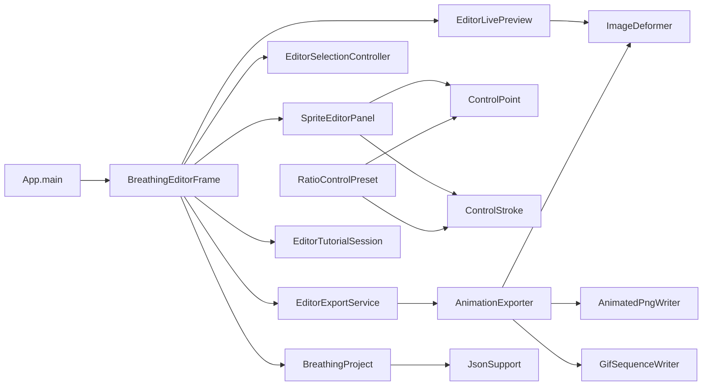
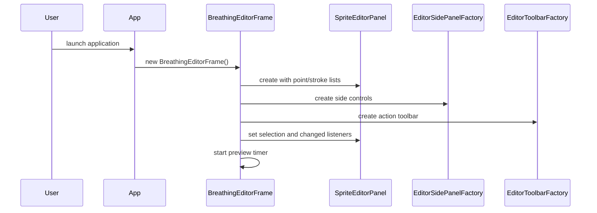
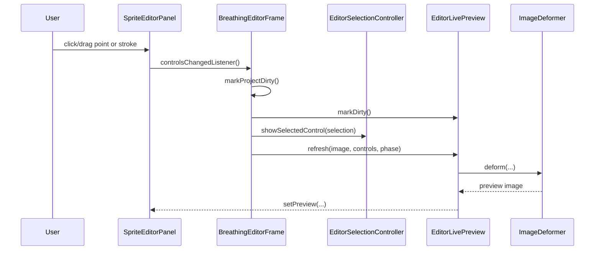
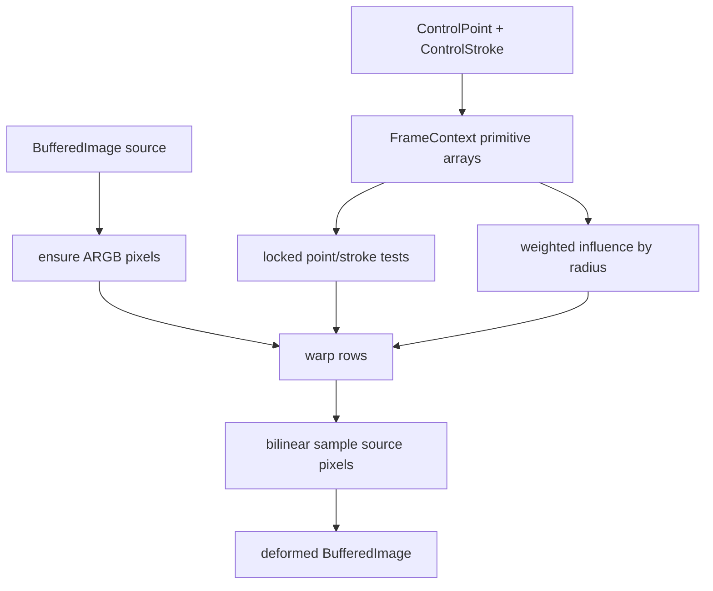
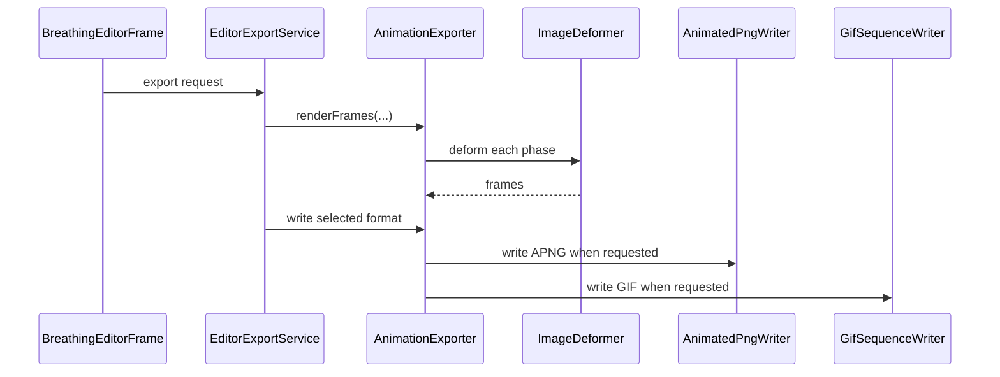
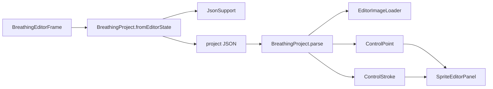
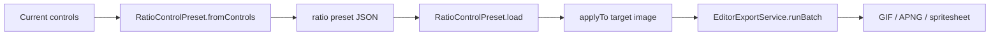
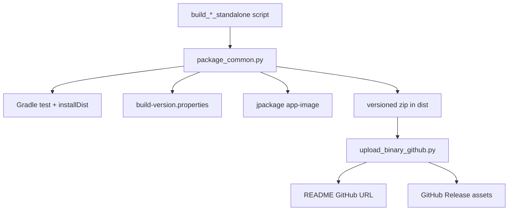

# Architecture

Breath is a desktop Java 21 Swing application. The editor keeps a mutable sprite model in memory, renders live preview frames through the deformation engine, and exports final animation assets through format-specific writers.

## Main Components

## Startup Flow

## Editing And Live Preview

## Deformation Pipeline

## Export Pipeline

## Project Save/Load

## Ratio Preset Batch Flow

## Packaging And GitHub Upload

