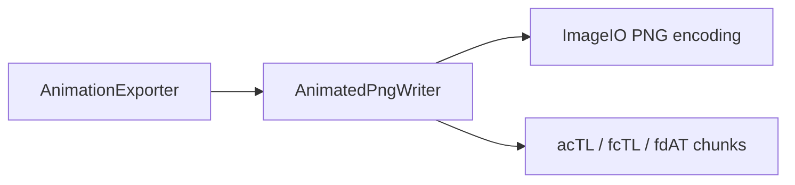

# AnimatedPngWriter

Source: [AnimatedPngWriter.java](../../app/src/main/java/org/example/AnimatedPngWriter.java)

## Purpose

Writes APNG files directly from rendered PNG frames while preserving full RGBA data.

## How It Fits

## Collaborators

- [AnimationExporter](AnimationExporter.md)

## Key Methods And Utility

- `write(...)`: Validates that all frames share one size, encodes each frame as PNG, then assembles a legal APNG stream.
- `chunksFor(...)`: Reuses Java's PNG encoder so pixel encoding stays compatible with the JDK instead of hand-writing deflate data.
- `frameControl(...)`: Writes APNG timing and frame bounds metadata for each frame.
- `writeChunk(...)`: Appends PNG chunks with their CRC; this is the integrity boundary for generated APNG files.

## Important Invariants

- APNG is the high-fidelity animated export path. It should preserve soft alpha, shadows, and anti-aliased edges better than GIF.
- Every frame must have identical dimensions. Atlas and animation consumers assume a stable frame rectangle.
- Sequence numbers must advance exactly as APNG expects: `fcTL` uses a sequence number and non-first frame data is written through `fdAT`.

## Maintenance Notes

- If APNG compatibility is changed, test output in browsers and image tools, not only by checking that a file exists.
- Keep this writer independent from deformation logic; it should only serialize already-rendered frames.
