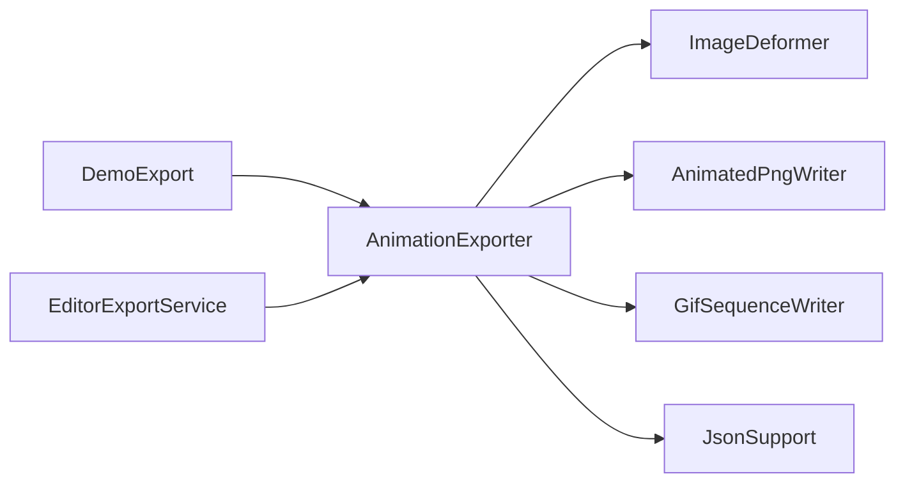

# AnimationExporter

Source: [AnimationExporter.java](../../app/src/main/java/org/example/AnimationExporter.java)

## Purpose

Turns a source sprite plus breathing controls into exported frame sequences, spritesheets, APNG, GIF, and atlas metadata.

## How It Fits

## Collaborators

- [AnimatedPngWriter](AnimatedPngWriter.md)
- [ControlPoint](ControlPoint.md)
- [ControlStroke](ControlStroke.md)
- [GifSequenceWriter](GifSequenceWriter.md)
- [ImageDeformer](ImageDeformer.md)
- [JsonSupport](JsonSupport.md)

## Key Methods And Utility

- `defaultTorsoPoints(...)`: Builds the Chips/demo control preset from image-relative positions so the smoke demo adapts to the bundled sprite size.
- `renderFrames(...)`: Samples a sinusoidal cycle and delegates each frame to `ImageDeformer`.
- `writePngSequence(...)`: Writes numbered `breath_000.png` style frames.
- `writeSpriteSheet(...)`: Packs rendered frames into a regular grid.
- `writeSpriteSheetWithAtlases(...)`: Writes the PNG sheet plus JSON and `.atlas` sidecars in one operation.
- `atlasPath(...)`: Keeps sidecar filenames tied to the sheet path.
- `writeGif(...)`: Uses `GifSequenceWriter` for compatibility-focused animation output.
- `writeAnimatedPng(...)`: Uses `AnimatedPngWriter` for alpha-safe animation output.
- `frameDelayMs(...)`: Converts duration and frame count into a bounded per-frame delay.

## Important Invariants

- All export formats must be generated from the same rendered frame list for a given request; otherwise PNG/APNG/GIF outputs can visually disagree.
- Atlas frame names and JSON timing are public output contracts used by README examples and batch export consumers.
- Frame delay is clamped so very short durations do not create unusable or viewer-hostile animations.

## Maintenance Notes

- When adding or renaming an output, update README, demo export docs, batch export code, and tests together.
- Keep APNG and GIF behavior separate: APNG is the fidelity path, GIF is the compatibility path.
