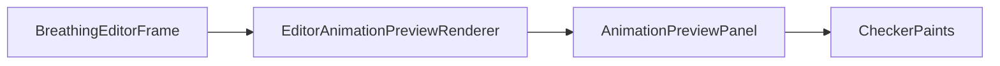

# AnimationPreviewPanel

Source: [AnimationPreviewPanel.java](../../app/src/main/java/org/example/AnimationPreviewPanel.java)

## Purpose

Displays a rendered frame list as a simple looping preview dialog.

## How It Fits

## Collaborators

- [CheckerPaints](CheckerPaints.md)
- [EditorAnimationPreviewRenderer](EditorAnimationPreviewRenderer.md)

## Key Methods And Utility

- `setFrames(...)`: Copies the rendered frames, resets playback to frame zero, and applies the exporter delay.
- `start()` / `stop()`: Control the Swing timer used for dialog playback.
- `advance()`: Moves through the frame list modulo its size.
- `paintComponent(...)`: Paints a checker background and scales the current frame into the available panel area.

## Important Invariants

- The panel receives fully rendered frames; it does not run deformation and should stay cheap to repaint.
- Frame copies are defensive so a background renderer cannot mutate the list while the timer is reading it.
- The checkerboard is part of alpha inspection. Removing it makes transparent-edge regressions harder to spot.

## Maintenance Notes

- Keep preview scaling bounded; very small or very large sprites should remain visible without resizing the dialog every frame.
