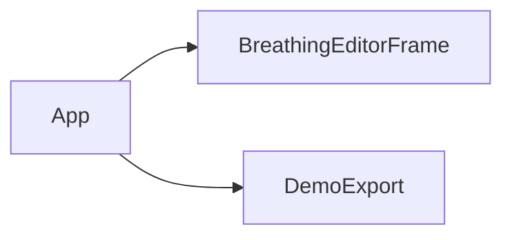

# App

Source: [App.java](../../app/src/main/java/org/example/App.java)

## Purpose

Application entry point for both the Swing editor and the headless demo export used by packaging smoke tests.

## How It Fits

## Collaborators

- [BreathingEditorFrame](BreathingEditorFrame.md)
- [DemoExport](DemoExport.md)

## Key Methods And Utility

- `main(...)`: Runs `DemoExport` when invoked with `--export-demo`; otherwise starts the Swing UI on the event dispatch thread.
- Look-and-feel setup: Tries the platform look and feel but falls back to Swing defaults if unavailable.

## Important Invariants

- `--export-demo` must remain headless because standalone packaging uses it to smoke-test generated binaries.
- UI construction must stay on the Swing event dispatch thread.

## Maintenance Notes

- Keep CLI flags minimal and stable. Packaging scripts call this entry point through the installed application image.
