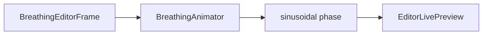

# BreathingAnimator

Source: [BreathingAnimator.java](../../app/src/main/java/org/example/BreathingAnimator.java)

## Purpose

Tracks playback time and converts it into the sinusoidal breathing phase used by preview rendering.

## How It Fits

## Collaborators

- [BreathingEditorFrame](BreathingEditorFrame.md)
- [EditorLivePreview](EditorLivePreview.md)

## Key Methods And Utility

- `play(...)`: Starts or resumes without losing paused elapsed time.
- `pause(...)`: Freezes elapsed time so phase remains stable while paused.
- `stop()`: Resets playback to the beginning of the breathing cycle.
- `setDurationSeconds(...)`: Clamps duration to avoid division by zero and unusably fast animation.
- `phase(...)`: Returns `sin(cycle * 2pi)`, matching export frame generation.

## Important Invariants

- Live preview and export both use sinusoidal phases, so the editor preview should match exported motion.
- Pausing should not reset the cycle; only `stop()` clears elapsed time.

## Maintenance Notes

- If the breathing curve changes, update `AnimationExporter.renderFrames` and tests at the same time.
