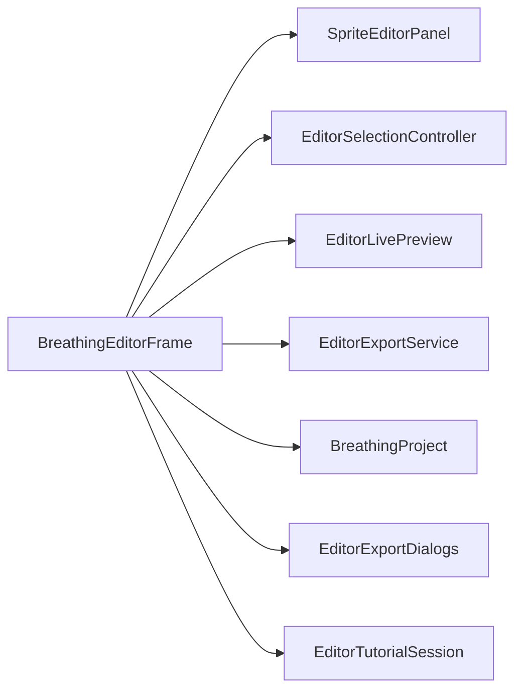

# BreathingEditorFrame

Source: [BreathingEditorFrame.java](../../app/src/main/java/org/example/BreathingEditorFrame.java)

## Purpose

Main Swing window and workflow coordinator for loading images, editing controls, previewing, saving, exporting, and tutorial handling.

## How It Fits

## Collaborators

- [AnimationPreviewPanel](AnimationPreviewPanel.md)
- [BreathingAnimator](BreathingAnimator.md)
- [BreathingProject](BreathingProject.md)
- [EditorAnimationPreviewRenderer](EditorAnimationPreviewRenderer.md)
- [EditorExportDialogs](EditorExportDialogs.md)
- [EditorExportService](EditorExportService.md)
- [EditorImageControlBounds](EditorImageControlBounds.md)
- [EditorImageLoader](EditorImageLoader.md)
- [EditorLivePreview](EditorLivePreview.md)
- [EditorSelectionController](EditorSelectionController.md)
- [EditorSidePanelFactory](EditorSidePanelFactory.md)
- [EditorToolbarFactory](EditorToolbarFactory.md)
- [EditorTutorialSession](EditorTutorialSession.md)
- [HelpContent](HelpContent.md)
- [HtmlHelpDialog](HtmlHelpDialog.md)
- [LastPathMemory](LastPathMemory.md)
- [RatioControlPreset](RatioControlPreset.md)
- [SpriteEditorPanel](SpriteEditorPanel.md)

## Key Methods And Utility

- Constructor: Creates shared editor state, toolbar, side panel, canvas, preview timer, selection wiring, and window close handling.
- `loadPng()` / `openProject()` / `saveProject()`: Own file workflows, dirty checks, and conversion between UI state and portable project JSON.
- `applyLoadedImage(...)` / `applyProject(...)`: Centralize the rules for replacing images, preserving or clamping controls, and refreshing preview state.
- `exportRatioPreset()` / `batchApplyRatioPreset()`: Bridge current absolute controls to reusable ratio presets and multi-file export.
- `togglePlayback()` / `stopPlayback()` / `refreshPreview()`: Coordinate `BreathingAnimator` with cancellable live preview rendering.
- `loadChipsTutorial()` / `restoreBeforeTutorial()`: Manage tutorial state and optional restoration of the user's previous project.
- `showAnimationPreview()` / `showPointEditor()`: Switch between edit mode and full-cycle preview mode.
- `runExport(...)`: Runs blocking export work in a `SwingWorker`, disables export buttons, and reports success/failure on the UI thread.
- `exportRequest()`: Captures the current image, controls, duration, and breath strength for export services.
- `confirmDiscardUnsavedChanges()` / `confirmReplaceControls(...)`: Protect user edits before destructive workflow changes.

## Important Invariants

- The frame is the workflow owner; helper classes should not show unrelated dialogs or mutate global editor state behind it.
- Dirty state and preview dirty state are separate. Saving clears project dirty state, while control edits also invalidate preview rendering.
- Live preview is paused or cancelled during heavier export operations so background workers do not compete for CPU or publish stale images.
- Project load prefers embedded images through `EditorImageLoader`, while image replacement can preserve controls only after bounds checks or explicit clamping.
- Export buttons are disabled during export to prevent overlapping writes to the same files.

## Maintenance Notes

- Keep this class as coordinator code. When a workflow grows complex, move reusable policy into a focused helper like the existing dialog, loader, export, or tutorial classes.
- Any new persisted setting needs updates in `BreathingProject`, `RatioControlPreset` if reusable, README examples, and tests.
