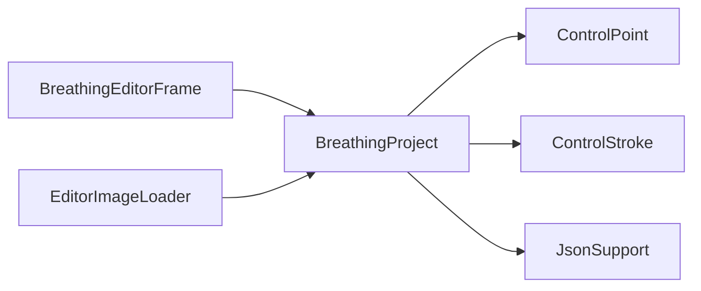

# BreathingProject

Source: [BreathingProject.java](../../app/src/main/java/org/example/BreathingProject.java)

## Purpose

Portable project model for JSON save/load, including embedded image bytes and all control metadata.

## How It Fits

## Collaborators

- [ControlPoint](ControlPoint.md)
- [ControlStroke](ControlStroke.md)
- [JsonSupport](JsonSupport.md)
- [EditorImageLoader](EditorImageLoader.md)

## Key Methods And Utility

- `public BreathingProject(...)`: Constructors normalize missing strings/lists and clamp negative breathing strength before state reaches the editor.
- `public List<ControlPoint> copiedPoints()` / `public List<ControlStroke> copiedStrokes()`: Return defensive copies so UI edits do not mutate saved record contents by reference.
- `public static BreathingProject fromEditorState(...)`: Captures the current image, controls, duration, and breathing strength into a portable save object.
- `public boolean hasEmbeddedImage()` / `public byte[] embeddedImageBytes()`: Provide the portable image path used by `EditorImageLoader` before filesystem fallback.
- `public void save(Path projectFile) throws IOException`: Writes JSON and stores relative image paths where possible for legacy readability.
- `public String toJson()`: Serializes current controls, colors, custom breath values, locks, and embedded image data.
- `public static BreathingProject load(Path projectFile) throws IOException`: Loads JSON relative to its project directory so older path-based saves still work.
- `public static BreathingProject parse(String json, Path baseDirectory)`: Applies defaults and legacy aliases such as `shoulder` for old unmovable point data.

## Important Invariants

- `imageBase64` makes project files portable and must remain the preferred save payload. `imagePath` is retained for user context and older JSON compatibility.
- The record stores immutable list snapshots. Callers that need to edit controls should use copied lists.
- Defaults in `parse` are part of backward compatibility; tightening them can break old project files and the bundled tutorial.

## Maintenance Notes

- When adding a control property, update project JSON, ratio presets, README examples, help JSON, and tests together.
- Keep Java 21 compatibility in mind: this project targets Java 21 across local runs, tests, and packaged runtimes.
