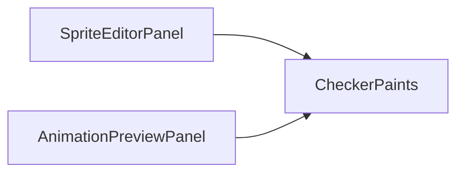

# CheckerPaints

Source: [CheckerPaints.java](../../app/src/main/java/org/example/CheckerPaints.java)

## Purpose

Creates reusable checkerboard paints for transparent image inspection.

## How It Fits

## Collaborators

- [AnimationPreviewPanel](AnimationPreviewPanel.md)
- [SpriteEditorPanel](SpriteEditorPanel.md)

## Key Methods And Utility

- `create(...)`: Builds a small tiled `TexturePaint` from two colors.

## Important Invariants

- The checker tile is cached by callers because editor panels repaint frequently during dragging, zooming, and playback.
- Checker contrast should stay subtle enough not to overpower sprite edges, but visible enough to reveal alpha artifacts.

## Maintenance Notes

- Keep this helper UI-only; export files should never include the checkerboard background.
