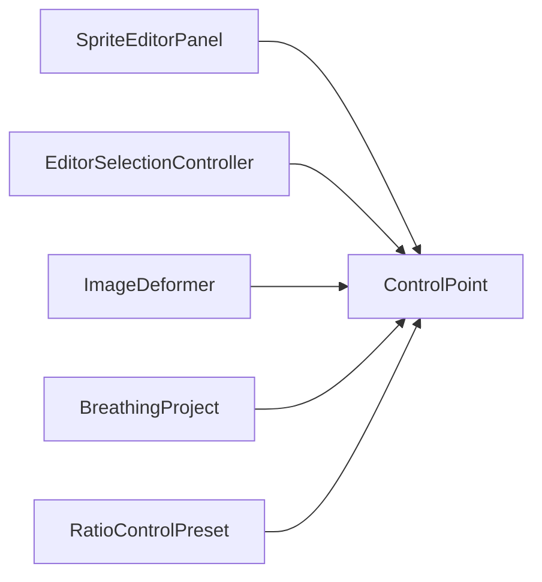

# ControlPoint

Source: [ControlPoint.java](../../app/src/main/java/org/example/ControlPoint.java)

## Purpose

Mutable point control used for localized breathing motion or locked influence regions.

## How It Fits

## Collaborators

- [ImageDeformer](ImageDeformer.md)
- [SpriteEditorPanel](SpriteEditorPanel.md)
- [BreathingProject](BreathingProject.md)
- [RatioControlPreset](RatioControlPreset.md)

## Key Methods And Utility

- Constructors: Normalize radius, color, outline width, custom breath, and the animated/unmovable flags when controls are created or loaded.
- `copy()`: Gives renderers and project snapshots a defensive mutable copy.
- Coordinate and offset setters: Allow the side panel and canvas drag logic to edit one control in place.
- `setAnimated(...)` / `setUnmovable(...)`: Enforce that a control cannot both move and lock pixels.
- `effectiveBreathingStrength(...)`: Applies per-control custom breath when present, otherwise uses the global strength.
- `warpAngleDegrees()` / `setWarpAngleDegrees(...)`: Let the UI edit direction while preserving warp distance.
- `currentOffsetX/Y(...)`: Returns the phase-scaled movement consumed by `ImageDeformer`.

## Important Invariants

- `Animated` and `Unmovable` are mutually exclusive at the model layer, not only in the UI. This protects project loading, tests, and future tools from contradictory state.
- Radius is clamped to at least one pixel so influence math never divides by a zero-sized region.
- Color is stored as RGB only; alpha belongs to the source image, not editor overlay colors.
- Outline width is visual-only and must not affect deformation radius.

## Maintenance Notes

- When adding point fields, update `BreathingProject`, `RatioControlPreset`, README JSON examples, and project persistence tests together.
