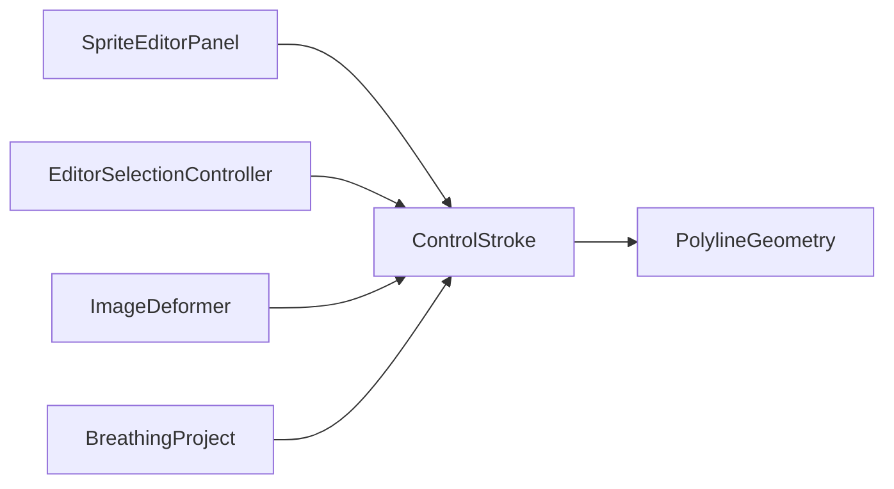

# ControlStroke

Source: [ControlStroke.java](../../app/src/main/java/org/example/ControlStroke.java)

## Purpose

Mutable free-line control used for broad drawn warp regions or drawn locked regions.

## How It Fits

## Collaborators

- [ImageDeformer](ImageDeformer.md)
- [PolylineGeometry](PolylineGeometry.md)
- [SpriteEditorPanel](SpriteEditorPanel.md)
- [BreathingProject](BreathingProject.md)
- [RatioControlPreset](RatioControlPreset.md)

## Key Methods And Utility

- Constructors: Copy source points, clamp radius, mask RGB color, and normalize animated/unmovable state.
- `addPoint(...)`: Adds drawn vertices while dropping near-duplicates to keep stroke data compact during mouse drag.
- `translateBy(...)`: Moves all vertices together for selected-control dragging.
- `clampPointsToImage(...)`: Keeps vertices inside a replacement image and recomputes cached bounds.
- `boundsMayContain(...)`: Fast hit-test and deformation prefilter before expensive polyline distance checks.
- `centerX/Y(...)`: Provides a stable UI anchor for selection status and spinner values.
- `setAnimated(...)` / `setUnmovable(...)`: Enforce the same movement-vs-lock invariant as points.
- `currentOffsetX/Y(...)`: Returns phase-scaled movement when the stroke is animated.

## Important Invariants

- Stroke bounds must be recomputed after any bulk coordinate edit; stale bounds break hit-testing and deformation regions.
- A stroke with one vertex is valid and behaves like a point-shaped polyline for distance calculations.
- `points()` returns copies for persistence/export callers, while package-local `pointsView()` lets hot paths avoid extra copies where mutation is controlled.

## Maintenance Notes

- Keep point and stroke flag semantics aligned. Users expect `Animated`, `Unmovable`, color, radius, and custom breath to behave the same way for both control types.
