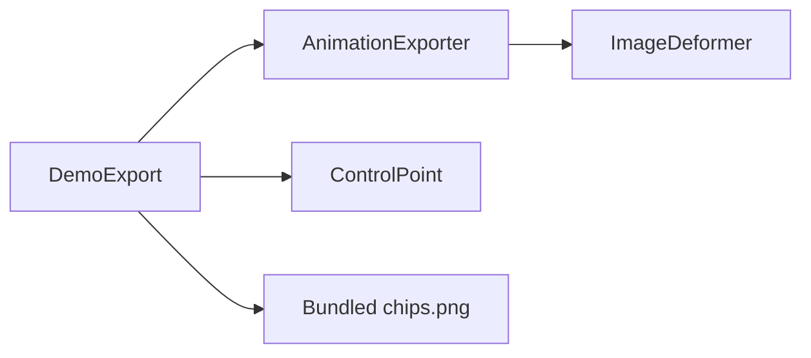

# DemoExport

Source: [DemoExport.java](../../app/src/main/java/org/example/DemoExport.java)

## Purpose

Headless demo exporter used by scripts, packaging smoke tests, and reproducible example outputs.

## How It Fits

## Collaborators

- [AnimationExporter](AnimationExporter.md)
- [ControlPoint](ControlPoint.md)

## Key Methods And Utility

- `private DemoExport()`: Prevents instantiation because the class is only a command entry point for scripted exports.
- `public static void main(String[] args) throws Exception`: Resolves the output directory from the first CLI argument, defaulting to `build/demo-output` for local smoke runs.
- `public static void run(Path outputDirectory) throws IOException`: Loads the bundled Chips sprite, applies the default torso controls, renders a full breathing cycle, and writes frames, spritesheet atlases, APNG, and GIF outputs.

## Important Invariants

- The exporter must stay headless. Packaging scripts run it from generated application images to verify the binary without opening Swing UI.
- Output filenames are part of the documented demo contract: README, `scripts/export-demo.sh`, and release checks refer to the `chips_breath_*` names.
- The bundled Chips sprite must be loaded from classpath resources so Gradle runs, installed distributions, and packaged smoke tests exercise the same asset path.

## Maintenance Notes

- Keep this class independent from Swing UI services. Packaging uses it as a smoke test, so it must stay runnable in headless environments.
- Keep the output names aligned with `README.md` and `scripts/export-demo.sh`; external docs and release checks refer to these generated files.
- If the bundled tutorial sprite path changes, update the jar content checks in the packaging scripts at the same time.
