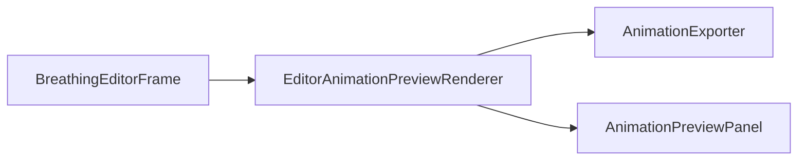

# EditorAnimationPreviewRenderer

Source: [EditorAnimationPreviewRenderer.java](../../app/src/main/java/org/example/EditorAnimationPreviewRenderer.java)

## Purpose

Renders the modal animation preview frames in a background worker.

## How It Fits

## Collaborators

- [AnimationExporter](AnimationExporter.md)
- [AnimationPreviewPanel](AnimationPreviewPanel.md)
- [ControlPoint](ControlPoint.md)
- [ControlStroke](ControlStroke.md)

## Key Methods And Utility

- `render(...)`: Starts a `SwingWorker`, renders all frames off the event dispatch thread, then publishes either the result or the failure.
- `RenderRequest`: Copies mutable controls and clamps frame count, breath strength, and duration before background work begins.
- `RenderResult`: Carries an immutable frame list and delay to `AnimationPreviewPanel`.

## Important Invariants

- This renderer is for explicit preview generation, not live editing. It renders a complete cycle rather than a single current phase.
- Input copies prevent dragging or spinner edits from changing the frame set halfway through rendering.

## Maintenance Notes

- Keep error reporting on the callback path so `BreathingEditorFrame` remains responsible for user-facing dialogs.
