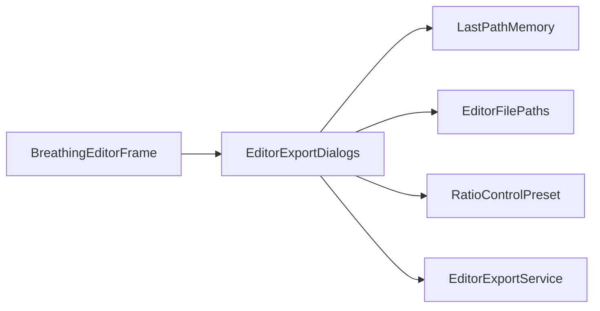

# EditorExportDialogs

Source: [EditorExportDialogs.java](../../app/src/main/java/org/example/EditorExportDialogs.java)

## Purpose

Owns Swing file choosers and overwrite confirmations for export and batch workflows.

## How It Fits

## Collaborators

- [EditorExportService](EditorExportService.md)
- [EditorFilePaths](EditorFilePaths.md)
- [LastPathMemory](LastPathMemory.md)
- [RatioControlPreset](RatioControlPreset.md)

## Key Methods And Utility

- `chooseRatioPresetTarget(...)`: Selects a JSON preset path and confirms replacement.
- `chooseBatchSelection(...)`: Collects preset, input PNGs, batch format, output directory, and overwrite confirmation as one user decision.
- `choosePngSequenceDirectory(...)`: Selects a directory because PNG sequences write many files.
- `chooseSpriteSheetTarget(...)`, `chooseAnimatedPngTarget(...)`, `chooseGifTarget(...)`: Apply default names, extensions, and overwrite checks for single-file exports.
- `confirmOverwrite(...)`: Protects existing files for regular exports.
- `confirmBatchOverwrite(...)`: Summarizes existing batch targets before allowing a multi-file overwrite.
- `BatchSelection`: Copies selected files so later dialog state cannot mutate the batch request.

## Important Invariants

- Dialog methods return `null` for cancellation. Callers must treat cancellation as a normal path, not an error.
- Extension normalization belongs here so export services receive concrete output paths and do not need UI policy.
- Batch overwrite confirmation is computed from the same `BatchExportFormat.fileNameFor(...)` logic that writes outputs.

## Maintenance Notes

- When adding a batch format, update the chooser labels, overwrite preview, service writer, README, and tests together.
