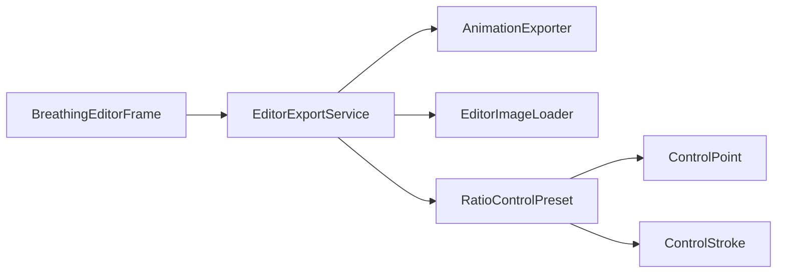

# EditorExportService

Source: [EditorExportService.java](../../app/src/main/java/org/example/EditorExportService.java)

## Purpose

Application-level export facade that renders frames and writes user-selected output formats.

## How It Fits

## Collaborators

- [AnimationExporter](AnimationExporter.md)
- [ControlPoint](ControlPoint.md)
- [ControlStroke](ControlStroke.md)
- [EditorImageLoader](EditorImageLoader.md)
- [RatioControlPreset](RatioControlPreset.md)

## Key Methods And Utility

- `private EditorExportService()`: Keeps export behavior as stateless package-level operations instead of UI-owned mutable state.
- `static void exportPngSequence(...)`: Renders one animation cycle and writes numbered PNG frames.
- `static void exportSpriteSheet(...)`: Renders frames and writes the sheet plus TexturePacker/Aseprite JSON and `.atlas` metadata.
- `static void exportAnimatedPng(...)`: Writes APNG output for sprites that need full alpha fidelity.
- `static void exportGif(...)`: Writes GIF output for compatibility, accepting the format's alpha and palette limits.
- `static BatchExportResult runBatch(...)`: Applies one ratio preset to multiple PNG files, writes the selected format, reports progress, and returns successes/failures.
- `private static List<BufferedImage> renderFrames(...)`: Centralizes frame generation so all formats use the same deformation phases.
- `private static void writeBatchFormat(...)`: Maps the user's batch format choice to the matching export writer.
- `BatchExportFormat.fileNameFor(...)`: Owns the public batch suffixes such as `_breath.gif`, `_breath_sheet.png`, and `_breath_apng.png`.

## Important Invariants

- Export and preview share `ImageDeformer`, but export renders a complete deterministic frame list before writing files.
- Batch export should continue collecting failures instead of aborting the whole set on the first bad image; this gives users actionable results for large folders.
- Batch filenames are documented in README, so suffix changes are a compatibility concern.

## Maintenance Notes

- When adding a new export format, update `EditorExportDialogs`, README, help JSON, tests, and batch overwrite handling together.
- Preserve APNG as the recommended transparent format; GIF should remain available but documented as lower fidelity.
