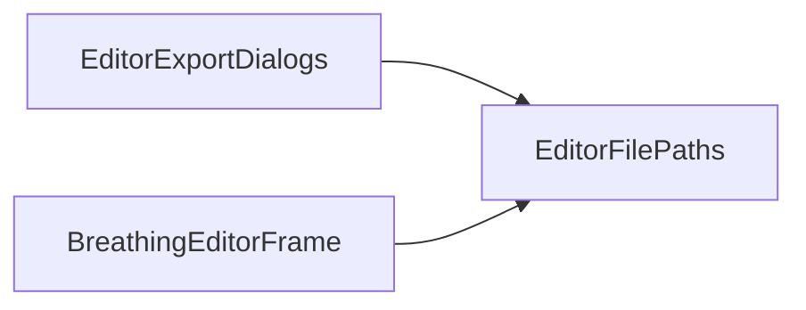

# EditorFilePaths

Source: [EditorFilePaths.java](../../app/src/main/java/org/example/EditorFilePaths.java)

## Purpose

Small path helper for enforcing expected save-file extensions.

## How It Fits

## Collaborators

- [EditorExportDialogs](EditorExportDialogs.md)

## Key Methods And Utility

- `withExtension(...)`: Returns the original path when it already has the expected extension, otherwise appends that extension beside the selected file.

## Important Invariants

- Extension comparison is case-insensitive so `Sprite.PNG` is not rewritten to `Sprite.PNG.png`.
- The helper appends rather than replaces unknown suffixes; a user-selected `name.backup` saved as PNG becomes `name.backup.png`, preserving intent.

## Maintenance Notes

- Keep this logic UI-facing. Import/load validation should continue to inspect actual file content where needed.
