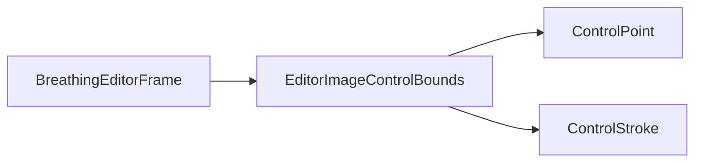

# EditorImageControlBounds

Source: [EditorImageControlBounds.java](../../app/src/main/java/org/example/EditorImageControlBounds.java)

## Purpose

Checks and clamps existing controls when a new image is loaded without clearing the current setup.

## How It Fits

## Collaborators

- [ControlPoint](ControlPoint.md)
- [ControlStroke](ControlStroke.md)

## Key Methods And Utility

- `controlsFitImage(...)`: Verifies that every point and every stroke vertex is inside the candidate image.
- `clampControlsToImage(...)`: Moves out-of-bounds controls back into the image after the user chooses to keep controls on a different-sized sprite.
- `insideImage(...)`: Uses image dimensions as the single source of truth for valid coordinates.

## Important Invariants

- A missing image is treated as fitting so callers can use the check safely before an image is loaded.
- Strokes clamp themselves because they own cached bounds used by hit-testing and deformation.

## Maintenance Notes

- Keep this helper aligned with ratio-preset application. Both paths retarget controls to new image dimensions.
