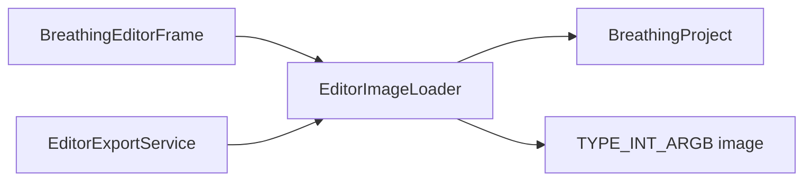

# EditorImageLoader

Source: [EditorImageLoader.java](../../app/src/main/java/org/example/EditorImageLoader.java)

## Purpose

Loads PNGs or project-embedded images and normalizes them to ARGB for deformation.

## How It Fits

## Collaborators

- [BreathingProject](BreathingProject.md)
- [EditorExportService](EditorExportService.md)

## Key Methods And Utility

- `private EditorImageLoader()`: Keeps loading rules centralized and prevents UI classes from creating duplicate helper instances.
- `static LoadedImage loadPng(Path path) throws IOException`: Loads a direct PNG file, normalizes its path, and converts the image to ARGB.
- `static LoadedImage loadProjectImage(BreathingProject project) throws IOException`: Reads `imageBase64` first for portable projects, then falls back to `imagePath` only for legacy or hand-written project files.
- `static BufferedImage toArgb(BufferedImage source)`: Converts images to `TYPE_INT_ARGB` so the deformer can read predictable alpha and color channels from packed pixels.
- `private static BufferedImage readImage(Path path) throws IOException`: Rejects unsupported image data early instead of letting export or preview fail later.

## Important Invariants

- Embedded image data has priority over the filesystem path. This lets saved JSON projects move between machines without breaking when local paths differ.
- Every loaded image must be ARGB before it reaches `ImageDeformer`; changing this would require reviewing pixel access and alpha interpolation.
- `LoadedImage.label` is presentation metadata only; it should not be used as the source of truth for locating the image.

## Maintenance Notes

- Keep project-load and batch-load behavior aligned. A PNG accepted in the editor should also be usable by batch export.
- When adding formats beyond PNG, update README, help JSON, tests, and the loader error messages together.
