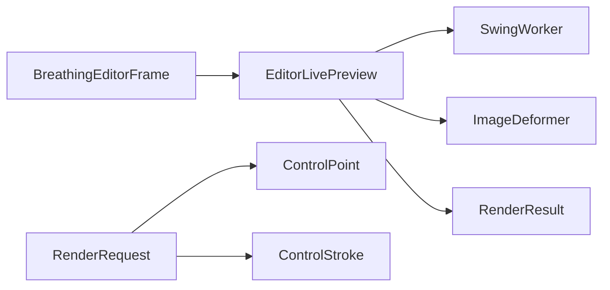

# EditorLivePreview

Source: [EditorLivePreview.java](../../app/src/main/java/org/example/EditorLivePreview.java)

## Purpose

Manages cancellable background deformation for the live editor preview.

## How It Fits

## Collaborators

- [ControlPoint](ControlPoint.md)
- [ControlStroke](ControlStroke.md)
- [ImageDeformer](ImageDeformer.md)

## Key Methods And Utility

- `void markDirty()`: Marks the current render stale and bumps a generation number so late workers cannot overwrite newer preview state.
- `void cancelActive()`: Cancels an active worker before expensive UI/export work, then bumps generation to ignore any result that still completes.
- `void refresh(...)`: Starts a background deformation only when the preview is dirty or animation is running; otherwise it reuses the last rendered image.
- `boolean dirty()`: Exposes whether an input change still needs a preview render.
- `boolean queued()`: Exposes whether a refresh was requested while another worker was already running.
- `static boolean isCancellation(Throwable throwable)`: Separates expected preview cancellation from real render failures shown to the user.

## Important Invariants

- Rendering runs outside the Swing event dispatch thread. `RenderRequest` copies points and strokes at the boundary so UI edits cannot mutate data while a worker is deforming pixels.
- Only the newest generation may publish a result. This avoids flicker and stale frames after quick drags, zoom changes, or export transitions.
- `queued` intentionally coalesces many rapid changes into one follow-up render; this keeps dragging responsive without dropping the final state.

## Maintenance Notes

- Any change to cancellation in `ImageDeformer` should be checked here, because preview responsiveness depends on periodic cancellation checks in row rendering.
- Keep export-pausing behavior intact: live preview should not compete with full export for CPU or publish partial frames while export is in progress.
