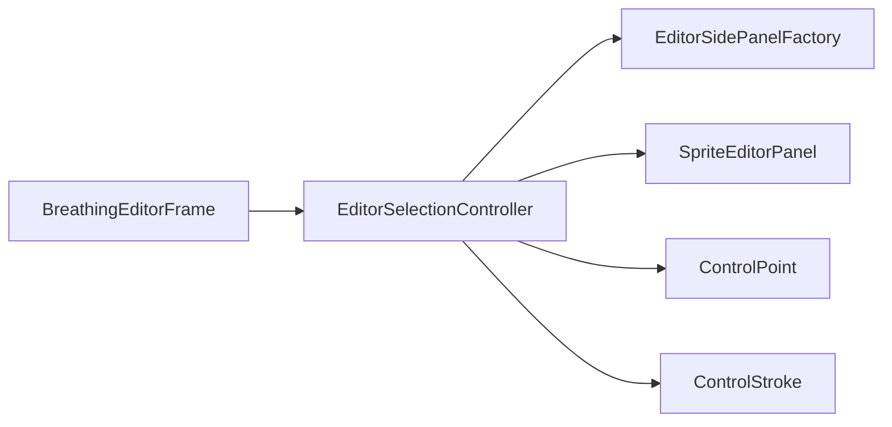

# EditorSelectionController

Source: [EditorSelectionController.java](../../app/src/main/java/org/example/EditorSelectionController.java)

## Purpose

Synchronizes side-panel controls with the currently selected point or stroke.

## How It Fits

## Collaborators

- [ControlPoint](ControlPoint.md)
- [ControlStroke](ControlStroke.md)
- [EditorSidePanelFactory](EditorSidePanelFactory.md)
- [SpriteEditorPanel](SpriteEditorPanel.md)

## Key Methods And Utility

- `wireSelectionSettings()`: Attaches spinner, checkbox, color, and custom-breath listeners to selected controls.
- `showSelectedControl(...)`: Copies model values into the side panel without triggering model writes.
- `setControlsEnabled(...)`: Enables only the controls valid for the current selection, for example point X/Y only for one selected point.
- `chooseSelectedColor()`: Applies one overlay color to all selected points/strokes.
- `updateSelectedControlAngle()`: Rotates animated controls while preserving their warp distance.
- `updateSelectedCustomBreathingStrength()`: Applies or clears per-control breath overrides.

## Important Invariants

- `updatingControls` prevents Swing listener feedback loops while UI is being synchronized from model state.
- Animated and unmovable checkboxes are kept mutually exclusive in the UI, matching model normalization in `ControlPoint` and `ControlStroke`.
- Point outline width is only enabled for point-only selections because strokes do not have circle outlines.

## Maintenance Notes

- Any new selected-control field needs both model-to-UI sync and UI-to-model update paths here.
- Keep color contrast logic local to the button display; it should not change saved control colors.
