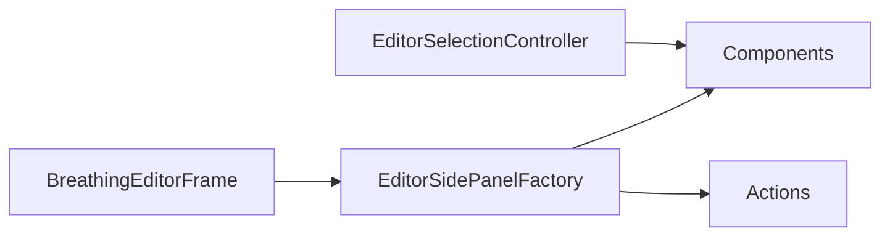

# EditorSidePanelFactory

Source: [EditorSidePanelFactory.java](../../app/src/main/java/org/example/EditorSidePanelFactory.java)

## Purpose

Builds the editor side panel from pre-created Swing controls and action callbacks.

## How It Fits

## Collaborators

- [BreathingEditorFrame](BreathingEditorFrame.md)
- [EditorSelectionController](EditorSelectionController.md)

## Key Methods And Utility

- `create(...)`: Lays out animation controls, tool buttons, selected-control fields, and mouse help text.
- `toolButtons(...)`: Wires mutually exclusive point/trait tool toggles.
- `selectionButtons(...)`: Wires next/delete selected-control actions.
- `row(...)`, `pairRow(...)`, `stackedField(...)`: Keep spinner layout consistent and compact.
- `cosmeticRow(...)`: Groups color and circle-line width because both affect editor overlay appearance.
- `Components`: Explicit bundle of controls shared with `EditorSelectionController`.
- `Actions`: Callback bundle provided by `BreathingEditorFrame`.

## Important Invariants

- This factory should not own application state. It assembles controls that the frame/controller already own.
- X/Y and offset pairs are paired intentionally to reduce vertical pressure in the fixed-width side panel.

## Maintenance Notes

- When adding a selected-control field, update `Components`, panel layout, controller wiring, README controls, and persistence if the value is saved.
