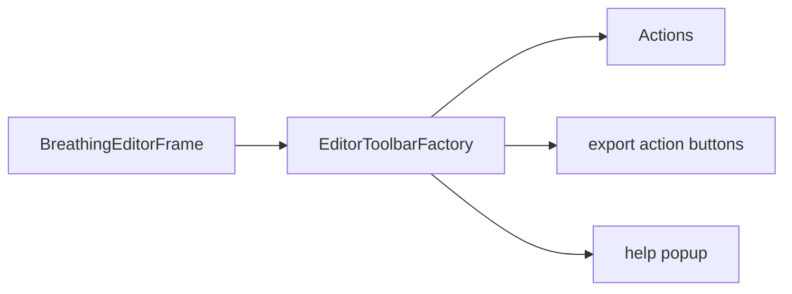

# EditorToolbarFactory

Source: [EditorToolbarFactory.java](../../app/src/main/java/org/example/EditorToolbarFactory.java)

## Purpose

Builds the main toolbar and wires buttons to frame-owned actions.

## How It Fits

## Collaborators

- [BreathingEditorFrame](BreathingEditorFrame.md)
- [HtmlHelpDialog](HtmlHelpDialog.md)

## Key Methods And Utility

- `create(...)`: Adds load/save, ratio, batch, playback, tutorial, export, and help controls in their visible toolbar order.
- `button(...)`: Standardizes one-action toolbar buttons.
- `helpButton(...)`: Uses a popup menu so Tutorial and About stay discoverable without two permanent toolbar buttons.
- `Actions`: Documents the toolbar contract expected from `BreathingEditorFrame`.

## Important Invariants

- Export-related buttons are collected in `exportActionButtons` so the frame can disable them while export is running.
- The close-tutorial button starts disabled because it is only meaningful after the tutorial captures a previous project snapshot.

## Maintenance Notes

- Toolbar labels are user-facing documentation. Keep README/control docs aligned when renaming them.
