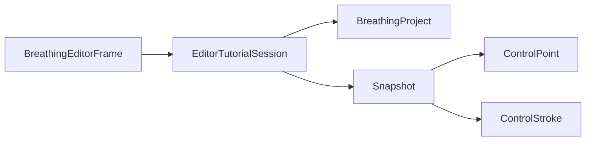

# EditorTutorialSession

Source: [EditorTutorialSession.java](../../app/src/main/java/org/example/EditorTutorialSession.java)

## Purpose

Tracks the temporary state needed to load the Chips tutorial and restore the user's previous project.

## How It Fits

## Collaborators

- [BreathingProject](BreathingProject.md)
- [ControlPoint](ControlPoint.md)
- [ControlStroke](ControlStroke.md)
- [SpriteEditorPanel](SpriteEditorPanel.md)

## Key Methods And Utility

- `captureBeforeTutorial(...)`: Stores the current editor state only once, before the tutorial takes over.
- `loadChipsProject()`: Loads the bundled `tutorial/chips_breath_project.json` resource and parses it as a normal project.
- `markTutorialLoaded()`: Marks the tutorial active after the frame successfully applies the project.
- `loadedStatus()`: Produces status text that differs depending on whether a previous user project can be restored.
- `consumeSnapshot()`: Returns the saved state and clears tutorial mode.
- `Snapshot`: Copies controls so tutorial edits cannot mutate the saved pre-tutorial state.

## Important Invariants

- The tutorial must load from classpath resources, not local files, so packaged standalone builds work the same as Gradle runs.
- Snapshot restoration should be one-shot. After `consumeSnapshot()`, the session is cleared to avoid restoring stale state later.

## Maintenance Notes

- If the tutorial resource path changes, update packaging jar checks and README references together.
