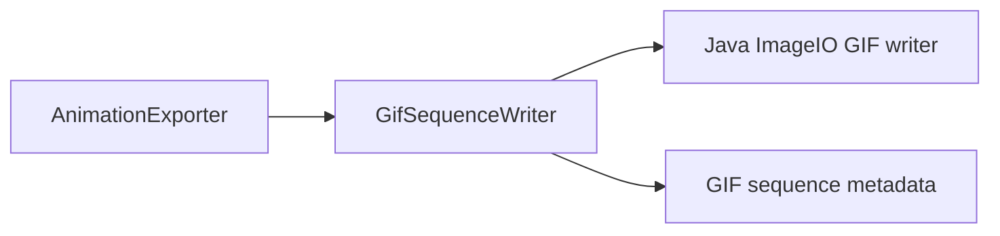

# GifSequenceWriter

Source: [GifSequenceWriter.java](../../app/src/main/java/org/example/GifSequenceWriter.java)

## Purpose

Writes animated GIF frames through Java ImageIO while controlling delay, disposal, and loop metadata.

## How It Fits

## Collaborators

- [AnimationExporter](AnimationExporter.md)

## Key Methods And Utility

- `public GifSequenceWriter(ImageOutputStream output, int imageType, int delayMs, boolean loop) throws IOException`: Opens the ImageIO GIF writer, prepares sequence output, and stores metadata that must be reused for every frame.
- `public void write(BufferedImage image) throws IOException`: Appends one already-rendered frame to the GIF sequence; deformation and timing decisions happen before this class is called.
- `public void close() throws IOException`: Finalizes the sequence and disposes the ImageIO writer so the resulting GIF is readable by external tools.
- `private void configureMetadata(IIOMetadata metadata, int delayMs, boolean loop) throws IOException`: Sets frame delay, loop extension, and background disposal to reduce trails on transparent sprites.
- `private IIOMetadataNode getOrCreate(IIOMetadataNode root, String name)`: Keeps metadata edits tolerant of JDK-specific node ordering.

## Important Invariants

- GIF is kept for compatibility, not fidelity. Java ImageIO quantizes frames and GIF transparency is limited, so APNG should remain the recommended export for soft alpha, shadows, and anti-aliased sprite edges.
- `restoreToBackgroundColor` is intentional: without it, transparent breathing frames can leave trails in some GIF viewers.
- Delay is stored in centiseconds, so callers pass milliseconds and this class clamps to at least one centisecond.

## Maintenance Notes

- Test GIF changes with a transparent Chips-like sprite, not only with opaque fixtures.
- Do not add APNG behavior here; APNG is handled by `AnimationExporter` through PNG frames and a separate writer path.
