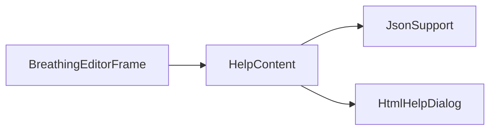

# HelpContent

Source: [HelpContent.java](../../app/src/main/java/org/example/HelpContent.java)

## Purpose

Loads JSON help resources and converts them into titled HTML pages for the help dialog.

## How It Fits

## Collaborators

- [HtmlHelpDialog](HtmlHelpDialog.md)
- [JsonSupport](JsonSupport.md)

## Key Methods And Utility

- `load(...)`: Reads a classpath JSON resource, parses title/pages, and computes the base URL for relative images.
- `resourceDirectory(...)`: Converts the JSON resource URL into its containing directory URL for Swing HTML rendering.
- `Page`: Normalizes blank titles and null HTML so dialogs always have displayable content.

## Important Invariants

- The base URL must point at the resource directory, not the JSON file. Swing's `HTMLDocument` resolves relative images from that base.
- Help content is classpath-based so images and JSON survive inside the packaged application image.

## Maintenance Notes

- When adding images to help JSON, test from both `./gradlew run` and a packaged runtime because resource URLs differ.
