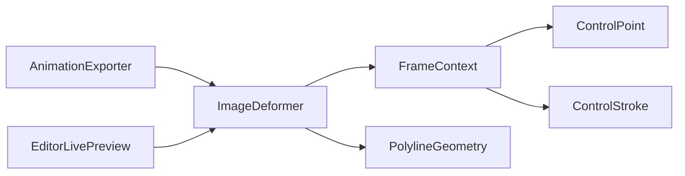

# ImageDeformer

Source: [ImageDeformer.java](../../app/src/main/java/org/example/ImageDeformer.java)

## Purpose

Core pixel deformation engine; blends control influences, honors locked regions, and samples source pixels bilinearly.

## How It Fits

## Collaborators

- [ControlPoint](ControlPoint.md)
- [ControlStroke](ControlStroke.md)
- [PolylineGeometry](PolylineGeometry.md)

## Key Methods And Utility

- `public BufferedImage deform(...)`: Public overloads used by tests, preview, and export to render one animation phase with optional strokes and global breathing strength.
- `BufferedImage deform(..., BooleanSupplier shouldCancel)`: Preview-aware entry point that lets `EditorLivePreview` cancel long renders without corrupting output state.
- `private void warpRows(...)` / `private void warpRow(...)`: Restricts work to the affected region and periodically checks cancellation while writing destination pixels.
- `Displacement calculateDisplacement(...)`: Computes the weighted inverse displacement for a pixel; tests call these methods directly because they define the visual behavior.
- `double distanceToStroke(...)`: Measures a pixel against a free-line stroke using `PolylineGeometry`, which gives strokes the same influence semantics as points.
- `int bilinearSample(...)`: Samples between source pixels after inverse mapping so movement stays smooth instead of snapping to nearest pixels.
- `static FrameContext build(...)`: Precomputes moving controls, lock controls, radii, offsets, and bounds for one frame to avoid repeating object-heavy work per pixel.
- `boolean isLocked(...)`: Gives unmovable points and strokes priority over animated controls so protected regions remain stable.
- `StrokeData.from(...)`: Converts mutable stroke objects into compact arrays and bounds used during frame rendering.

## Important Invariants

- Deformation is inverse-mapped: each destination pixel asks where it should sample from in the source. This avoids holes that forward-pushing pixels would create.
- Lock controls are evaluated before movement. If a pixel is inside an unmovable point or stroke radius, animated influences must not move it.
- Influence falls with distance and is blended across all active controls; changing that weighting changes the look of every saved project and ratio preset.
- `FrameContext` stores primitive arrays intentionally. Per-pixel object allocation would make preview dragging and GIF/APNG export noticeably slower.
- ARGB channel interpolation must preserve alpha. This is why loaders normalize images and why GIF remains a lower-fidelity export path.

## Maintenance Notes

- Keep the direct `calculateDisplacement` tests when changing math; rendered-image tests alone make regressions hard to diagnose.
- Any optimization should be checked on both preview responsiveness and exported frame equality, because this class is shared by live UI and all export formats.
