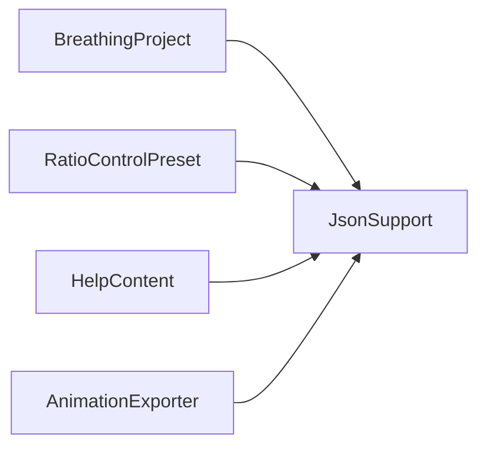

# JsonSupport

Source: [JsonSupport.java](../../app/src/main/java/org/example/JsonSupport.java)

## Purpose

Shared tolerant JSON helpers for projects, presets, help resources, and atlas metadata.

## How It Fits

## Collaborators

- [BreathingProject](BreathingProject.md)
- [RatioControlPreset](RatioControlPreset.md)
- [HelpContent](HelpContent.md)
- [AnimationExporter](AnimationExporter.md)

## Key Methods And Utility

- `GSON`: Shared pretty-printing Gson instance with null serialization and disabled HTML escaping.
- `parseObject(...)`: Converts missing, null, or non-object JSON into an empty object rather than throwing.
- `string(...)`, `number(...)`, `bool(...)`: Read typed values with fallbacks for malformed user-editable JSON.
- `optionalNumber(...)`: Preserves null vs numeric values for optional custom breath fields.
- `color(...)` / `colorHex(...)`: Round-trip RGB values as `#RRGGBB` strings.

## Important Invariants

- Parsing is intentionally tolerant for project compatibility. Validation belongs in schema-specific classes when a field is mandatory.
- `serializeNulls()` is required so optional fields such as custom breath remain explicit in saved JSON examples and files.
- Colors are RGB-only; alpha is image data, not metadata.

## Maintenance Notes

- Avoid adding schema-specific defaults here. Keep this class generic so project, preset, help, and atlas code do not influence each other unexpectedly.
