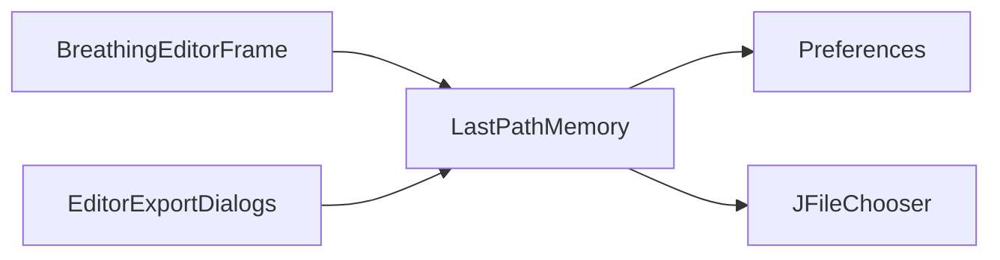

# LastPathMemory

Source: [LastPathMemory.java](../../app/src/main/java/org/example/LastPathMemory.java)

## Purpose

Remembers the last directory used by file choosers across load, save, and export workflows.

## How It Fits

## Collaborators

- [BreathingEditorFrame](BreathingEditorFrame.md)
- [EditorExportDialogs](EditorExportDialogs.md)

## Key Methods And Utility

- `configure(...)`: Applies the remembered directory to a `JFileChooser` when it still exists.
- `rememberSelection(...)`: Stores either the selected directory or the parent directory of a selected file.
- `rememberDirectory(...)`: Persists a normalized absolute directory path in Java preferences.
- `lastDirectory()`: Returns the stored directory, then the fallback `export` directory, then `null`.

## Important Invariants

- Missing directories are ignored. File choosers should not open on stale paths after a directory is deleted or moved.
- The fallback is optional because a clean clone may not have `export/` yet.

## Maintenance Notes

- Keep this class small and injectable; tests can pass a custom `Preferences` node and fallback path.
