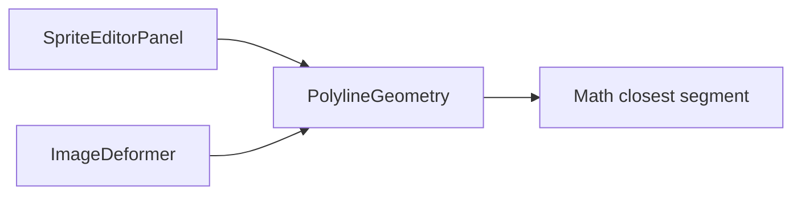

# PolylineGeometry

Source: [PolylineGeometry.java](../../app/src/main/java/org/example/PolylineGeometry.java)

## Purpose

Computes distances from pixels or mouse positions to free-line strokes.

## How It Fits

## Collaborators

- [ControlStroke](ControlStroke.md)
- [ImageDeformer](ImageDeformer.md)
- [SpriteEditorPanel](SpriteEditorPanel.md)

## Key Methods And Utility

- `distanceToPolyline(...)`: Public package-level convenience methods that return actual distance for UI hit-testing.
- `distanceSquaredToPolyline(...)`: Avoids square roots in hot deformation paths when only comparisons are needed.
- Array overload: Works with `ImageDeformer.FrameContext` primitive arrays to avoid per-pixel object access.
- `distanceSquaredToSegment(...)`: Projects a point onto a segment, clamps to the segment ends, and handles degenerate segments as points.

## Important Invariants

- Empty polylines return infinity so they never influence deformation or hit-testing.
- Single-point strokes are valid and treated as point distance checks.
- Degenerate segment handling prevents tiny repeated drag points from producing unstable divisions.

## Maintenance Notes

- Keep list and array overloads behaviorally identical. Preview/export correctness depends on the optimized path matching UI hit-testing expectations.
