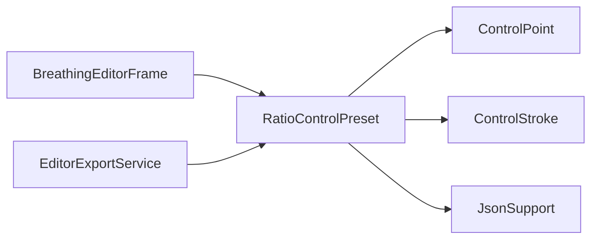

# RatioControlPreset

Source: [RatioControlPreset.java](../../app/src/main/java/org/example/RatioControlPreset.java)

## Purpose

Stores control coordinates as image-size ratios so one breathing setup can be applied to sprites with different dimensions.

## How It Fits

## Collaborators

- [ControlPoint](ControlPoint.md)
- [ControlStroke](ControlStroke.md)
- [JsonSupport](JsonSupport.md)
- [EditorExportService](EditorExportService.md)

## Key Methods And Utility

- `public static RatioControlPreset fromControls(...)`: Converts absolute editor controls into ratios using image width, height, and the smaller dimension for radii.
- `public void save(Path path) throws IOException`: Persists the preset without embedding the source image, keeping it lightweight and reusable.
- `public String toJson()`: Serializes duration, global strength, points, strokes, colors, locks, and optional custom breath values.
- `public static RatioControlPreset load(Path path) throws IOException`: Reads a preset file from disk before validation and parsing.
- `public static RatioControlPreset parse(String json)`: Validates the preset header and applies defaults before controls reach batch export.
- `private static void validateHeader(JsonObject root)`: Rejects non-preset JSON so project files are not accidentally treated as reusable presets.
- `public AppliedControls applyTo(BufferedImage image)`: Rehydrates ratio coordinates into absolute controls for the target sprite dimensions.

## Important Invariants

- Presets intentionally do not store image bytes. They describe control geometry only, which is why they are suitable for batch application.
- X values scale with width, Y values scale with height, and radii scale with the smaller dimension. This preserves influence shape across differently sized sprites.
- Custom breath values and unmovable flags must round-trip; otherwise batch export can change the motion compared with the source project.

## Maintenance Notes

- Keep project JSON and ratio-preset JSON similar where possible, but do not merge them: projects are portable saves, presets are reusable control templates.
- Update README's JSON examples and batch export tests whenever the preset schema changes.
