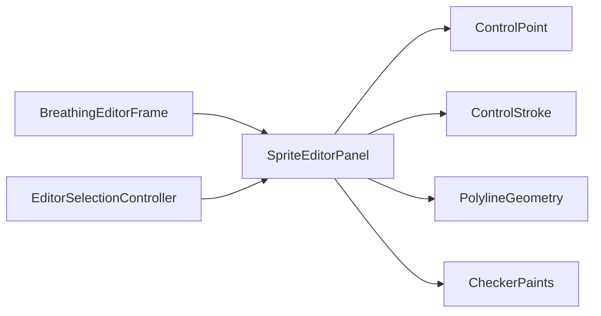

# SpriteEditorPanel

Source: [SpriteEditorPanel.java](../../app/src/main/java/org/example/SpriteEditorPanel.java)

## Purpose

Main canvas for displaying the sprite, editing points and strokes, selecting controls, zooming, panning, and painting overlays.

## How It Fits

## Collaborators

- [CheckerPaints](CheckerPaints.md)
- [ControlPoint](ControlPoint.md)
- [ControlStroke](ControlStroke.md)
- [EditorSelectionController](EditorSelectionController.md)
- [PolylineGeometry](PolylineGeometry.md)

## Key Methods And Utility

- Constructor: Installs mouse handlers, wheel zoom, panning, selection box, warp-angle drag, stroke drawing, and delete key bindings.
- `setImage(...)`: Replaces the image, optionally clears controls, resets zoom/pan, and refreshes selection.
- `setPreview(...)`: Displays the latest deformed image while preserving editable overlays.
- `setControls(...)`: Copies loaded controls into the editable model and chooses an initial selection.
- `forEachSelectedControl(...)`: Applies side-panel changes to multi-selections and single active controls uniformly.
- `deleteSelectedControl()` / `selectNextControl()`: Mutate selection-aware control lists and notify the frame once.
- `fitImage()`: Calculates a bounded zoom that keeps the sprite visible in the canvas.
- Mouse press/drag/release handlers: Add/select/move points, draw strokes, pan, select boxes, and rotate warp direction.
- `Selection`: Snapshot-like view of the active selection used by `EditorSelectionController`.

## Important Invariants

- Dragging defers expensive `controlsChanged` notifications until release for most gestures. This keeps the UI responsive and avoids excessive preview workers.
- Screen/image coordinate conversion must stay consistent with zoom and pan; selection, drawing, and overlay painting all depend on it.
- Multi-selection stores stable indices until mutation. Deletion removes indices in descending order to avoid shifting later removals.
- The panel paints overlays on top of `previewImage`, not `originalImage`, so users can edit while seeing current deformation.
- Strokes and points share selection/update paths where possible, but point-only properties such as outline width remain point-specific.

## Maintenance Notes

- Any new mouse gesture should explicitly decide when to call `notifyControlsChanged()`; calling it on every drag pixel can make preview sluggish.
- Keep hit-testing and deformation geometry aligned through `PolylineGeometry` and stroke radius semantics.
